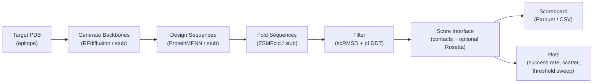

# binder-bench

**Reproducible benchmark harness for de novo protein-binder design.**

`binder-bench` orchestrates the full generate→design→fold→filter→score pipeline, provides CPU/stub backends so CI is always green without a GPU, and outputs a ranked Parquet/CSV scoreboard plus publication-quality plots.

---

## The De Novo Binder Problem (first principles)

A **protein binder** is a small designed protein (typically 50–150 residues) that folds into a stable structure and binds a target protein surface (the *epitope*) with high specificity and affinity. Unlike small molecules, protein binders can engage large, flat interfaces; unlike antibodies, they can be expressed in bacteria and engineered for extreme stability.

**Why is de novo design hard?**  
The sequence space for a 70-residue protein is 20⁷⁰ ≈ 10⁹¹ — astronomically larger than what evolution or experiment can sample. There is no template to copy from, and the landscape of structures that bind a specific epitope is sparsely populated.

**Why does generate→design→filter work?**  
The pipeline separates two problems that are easier to solve independently:

1. **Generate backbones** (topology): RFdiffusion samples 3-D backbone conformations that are geometrically complementary to the epitope, without worrying about sequence. This reduces the problem to a much smaller space of plausible shapes.
2. **Design sequences** (chemistry): ProteinMPNN then asks "what amino-acid sequence would fold into *this* backbone?" — a well-posed inverse-folding problem that it solves reliably.
3. **Validate** (filter): A folding model (ESMFold or AF2) independently predicts the structure of each designed sequence. If it folds back to the intended backbone (low self-consistency RMSD) *and* the model is confident (high pLDDT), the design is likely to fold as intended in the lab.

**What is self-consistency RMSD?**  
You designed sequence *S* specifically for backbone *B*. If you fold *S* independently (without telling the folding model anything about *B*), you get predicted structure *P*. The CA-RMSD between *B* and *P* — after optimal Kabsch superposition — is the **self-consistency RMSD (scRMSD)**. A low scRMSD (< 2 Å) means the sequence encodes the intended structure; high scRMSD means the sequence probably folds differently and will fail experimentally.

**What is pLDDT?**  
pLDDT (predicted local distance difference test) is a per-residue confidence score from ESMFold/AlphaFold2, stored in the B-factor column (0–100). High pLDDT (> 70) means the model is confident the residue is in the predicted position; low pLDDT signals disorder or a misfold. For binders, you want mean pLDDT > 70 across the whole chain.

**What success rate should I expect?**  
With RFdiffusion + ProteinMPNN + ESMFold:
- RMSD < 2 Å + pLDDT > 70: **~20–40%** for short binders (50–80 aa) (Watson et al., arxiv 2210.04673)
- RMSD < 1.5 Å + pLDDT > 80: **~10–15%** (more stringent)
- Of those that pass computational filters, **~10–25%** have detectable binding in yeast display (Bennett et al., Nature 2023)

---

## Architecture



---

## Installation

```bash
# CPU / stub backends only (for development and CI)
pip install binder-bench

# With GPU support (adds PyTorch for real backends)
pip install "binder-bench[gpu]"

# Development install from source
git clone https://github.com/binder-bench/binder-bench.git
cd binder-bench
pip install -e ".[dev]"
```

### Optional: real GPU backends

| Backend | Install | Notes |
|---------|---------|-------|
| RFdiffusion | `pip install git+https://github.com/RosettaCommons/RFdiffusion.git` | CUDA required |
| ProteinMPNN | `pip install git+https://github.com/dauparas/ProteinMPNN.git` | Runs on CPU |
| ESMFold API | built-in (HTTP) | Uses ESM Atlas cloud API, no local GPU needed |

---

## Quickstart

```bash
# 1. Write a default config.yaml
binder-bench init

# 2. Run the full pipeline (stub backends, no GPU)
binder-bench run examples/config_quickstart.yaml -v

# 3. Validate a config without running
binder-bench validate my_config.yaml

# 4. Re-score an existing output with new thresholds
binder-bench score-only output/20240115_143022/ --rmsd-threshold 1.5 --plddt-threshold 80
```

---

## Configuration Reference

All options live in a YAML file. Run `binder-bench init` to generate a starting point.

### Generate

| Field | Type | Default | Description |
|-------|------|---------|-------------|
| `backend` | `"rfdiffusion"` \| `"stub"` | `"stub"` | Backbone generation method |
| `n_designs` | int | 10 | Number of backbones to generate (1–1000) |
| `seed` | int | 42 | RNG seed for reproducibility |
| `stub_dir` | path | `examples/backbones` | Pre-computed PDBs for stub mode |
| `target_pdb` | path | None | Target PDB for RFdiffusion |
| `hotspot_residues` | list[str] | [] | e.g. `["A.15", "A.20"]` |

### Design

| Field | Type | Default | Description |
|-------|------|---------|-------------|
| `backend` | `"proteinmpnn"` \| `"stub"` | `"stub"` | Sequence design method |
| `n_seqs_per_backbone` | int | 8 | Designed sequences per backbone (1–64) |
| `temperature` | float | 0.1 | ProteinMPNN sampling temperature |
| `seed` | int | 42 | RNG seed |

### Fold

| Field | Type | Default | Description |
|-------|------|---------|-------------|
| `backend` | `"esmfold_api"` \| `"stub"` | `"stub"` | Structure prediction method |
| `esmfold_api_url` | str | (ESM Atlas URL) | Custom API endpoint if needed |

### Filter

| Field | Type | Default | Description |
|-------|------|---------|-------------|
| `rmsd_threshold` | float | 2.0 | Max self-consistency RMSD (Å) to pass |
| `plddt_threshold` | float | 70.0 | Min mean pLDDT to pass |
| `min_binder_length` | int | 50 | Minimum binder length (residues) |
| `max_binder_length` | int | 150 | Maximum binder length (residues) |

### Score

| Field | Type | Default | Description |
|-------|------|---------|-------------|
| `contact_distance` | float | 8.0 | CA–CA distance threshold for contacts (Å) |
| `rosetta_enabled` | bool | false | Enable Rosetta interface scoring |
| `foldx_enabled` | bool | false | Enable FoldX ΔΔG scoring |

### Output

| Field | Type | Default | Description |
|-------|------|---------|-------------|
| `output_dir` | path | `output` | Root output directory |
| `scoreboard_format` | `"parquet"` \| `"csv"` | `"parquet"` | Scoreboard file format |
| `save_passing_structures` | bool | true | Copy passing PDBs to `passing/` subdir |
| `plot_success_rate` | bool | true | Generate summary plots |

---

## Backend Plugin API

Each pipeline stage has an abstract base class. To add a new backend, subclass it:

```python
from pathlib import Path
from binder_bench.fold import StructurePredictor
from binder_bench.config import FoldConfig


class MyLocalESMFold(StructurePredictor):
    def fold(self, sequence: str, output_path: Path, config: FoldConfig) -> Path:
        import esm                          # local install
        model, alphabet = esm.pretrained.esmfold_v1()
        model.eval()
        with torch.no_grad():
            output = model.infer_pdb(sequence)
        output_path.parent.mkdir(parents=True, exist_ok=True)
        output_path.write_text(output)
        return output_path
```

Then register it in `get_predictor()` in `fold.py`, or pass it directly to `run_fold()`.

---

## Outputs

After a run, `output/{run_id}/` contains:

| File | Description |
|------|-------------|
| `scoreboard.parquet` (or `.csv`) | All designs ranked by pLDDT, RMSD, interface score |
| `stats.json` | Aggregate statistics: success rate, mean pLDDT, best design |
| `passing/*.pdb` | Folded structures of all passing designs |
| `plots/success_rate.png` | Bar chart of pass/fail counts |
| `plots/rmsd_plddt_scatter.png` | Scatter plot coloured by pass/fail |
| `plots/threshold_sweep.png` | Heatmap of success rate vs. RMSD × pLDDT thresholds |
| `plots/score_distribution.png` | pLDDT histogram for pass/fail |
| `folded/*.pdb` | All folded structures (before filtering) |

---

## Cookbook

| Notebook | Description |
|----------|-------------|
| [01_full_run.md](docs/cookbook/01_full_run.md) | Full pipeline run against IL-6R; reading the scoreboard |
| [02_threshold_sweep.md](docs/cookbook/02_threshold_sweep.md) | Yield–stringency trade-off; heatmap interpretation |
| [03_backend_comparison.md](docs/cookbook/03_backend_comparison.md) | ProteinMPNN vs. stub baseline on the same backbones |
| [04_downstream_integration.md](docs/cookbook/04_downstream_integration.md) | Loading results into pandas; appending a docking stage |

---

## Tests

```bash
# Run the full test suite
pytest tests/ -v

# Run only the Kabsch RMSD tests
pytest tests/test_metrics.py -v

# Run only the filter logic tests
pytest tests/test_filter.py -v

# Run only the stub pipeline test
pytest tests/test_pipeline.py -v
```

All tests pass on CPU without a GPU or any external API calls.

---

## Citation

If you use binder-bench in your research, please cite:

- **RFdiffusion**: Watson et al. (2023). *De novo design of protein structure and function with RFdiffusion*. Nature. arXiv:2210.04673
- **ProteinMPNN**: Dauparas et al. (2022). *Robust deep learning-based protein sequence design using ProteinMPNN*. Science 378, 49–56.
- **ESMFold**: Lin et al. (2023). *Evolutionary-scale prediction of atomic-level protein structure with a language model*. Science 379, 1123–1130.

## License

GNU General Public License v3.0. See [LICENSE](LICENSE).
